# LINUX PROJECT IMPLEMENTATION

I will be documenting here some my Linux basic commands.

## SUDO COMMAND

The sudo command is also known as a super user do command which is used to frant administrative priviledges to a certain user to manipulate root files and folders.

To use the sudo command I ran the following syntax `sudo apt upgrade`

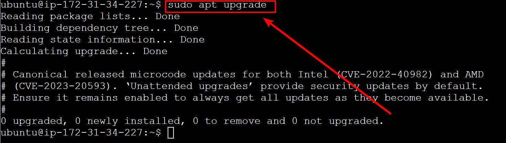

## PWD COMMAND

-   
I use a PWD command to know and find the part of my present or the exact directory where i am working from.

to use the pwd command i ran the command syntax `pwd`

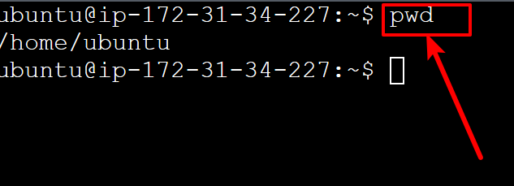 

## CD COMMAND

-   I used a CD command to change directory and to locate the directory Foundation_Class in my system.

to use the cd command, I ran the following command syntax `cd foundation-class`

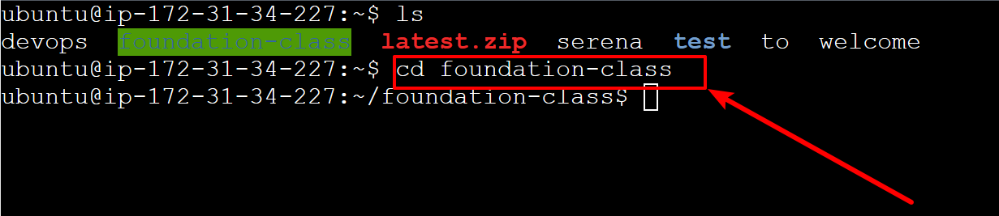

## LS COMMAND

-   I used the LS command to view all files and direcories withing the system

to use the LS command, I ran the following syntax `ls` on my home directory 

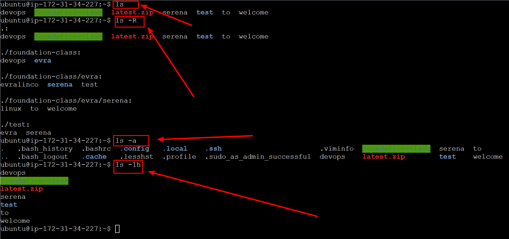

## CAT COMMAND

This command list, combines and writes files contents to the standard output

to use the CAT command, i ran the following syntax `cat devops`

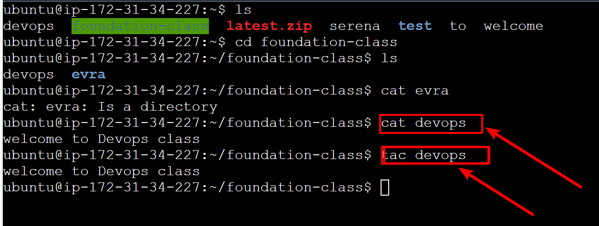

## CP COMMAND

This command is used to copy files and directories with their content.

to use this command, I ran the following command `cp serena /home/ubuntu/test` and copied file serena into folder test

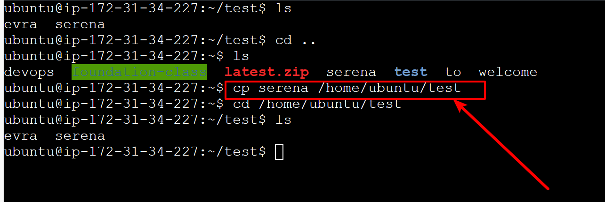

## MV COMMAND

This command is used to move files and directories into another directory. It can also be used to rename files or directory.

to use this command, I ran the following syntax `mv serena /home/ubuntu/test`

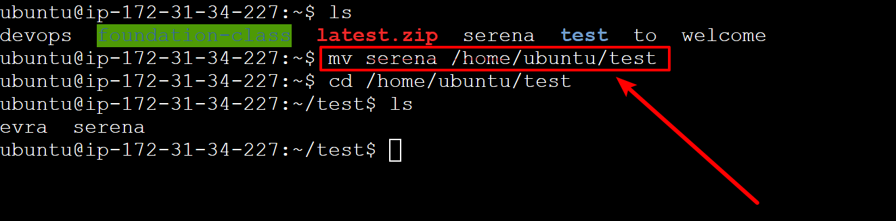

## MKDIR COMMAND

This command is used to create one or more diectories and set permissions for each of them.

to use this command, i ran the following syntax `mkdir music` 

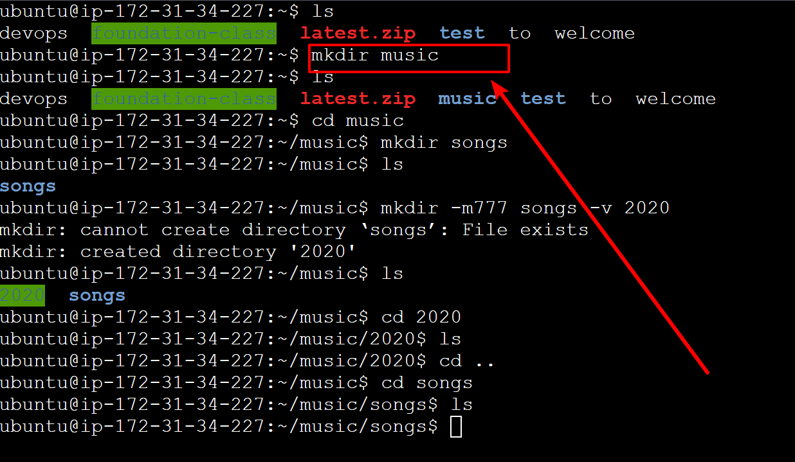

## RMDIR COMMAND

This command is used to permanently delete an empty directory. 

to use this command i ensured i used a sudo priviledges while i was on the parent directory. Then i ran the following syntax `rmdir 2020`

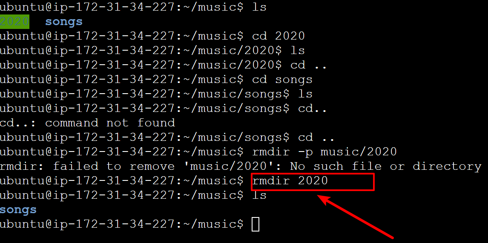

## RM COMMAND

This command is used to delete files within a directory. The user must have write priviledges.

to use the command i ensured i had write prviledges before i ran the syntax `rm to welcome`

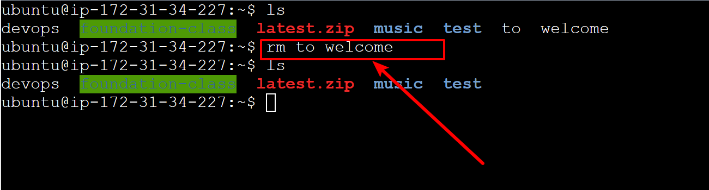

## TOUCH COMMAND 

This command is used to create and empty file or generate and create a timestamp on the linux command line.

to use this command, I ran the following syntax `touch sqlite_commands.sh`

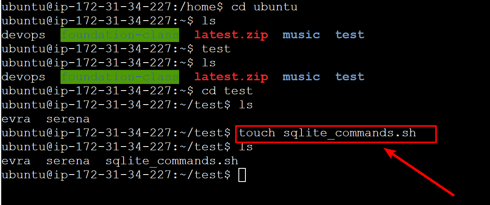

## LOCATE COMMAND

This command is used to find a file in a database system. adding -i will make it case insensitive hench you can find any file with ease.

to use this command, I ran the following syntax `locate serena` and `locate -i evra`

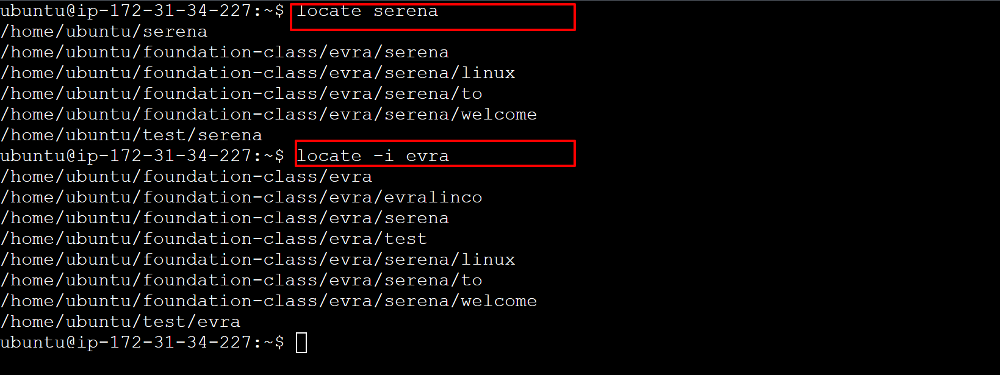

## FIND COMMAND

This command is used to find a file in a specific directory.

to use the command, I ran the following syntax `find /home/ubuntu/foundation-class`

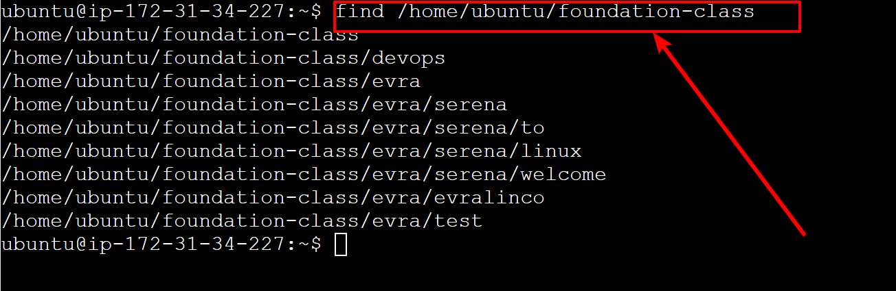

## GREP COMMAND

This command is used to filter a file. you use the grep command to find a word in a specific file. grep prints out all the lines that contains a specific partern.

to use this command, i ran the following syntax `grep serena` ### but it did not run.

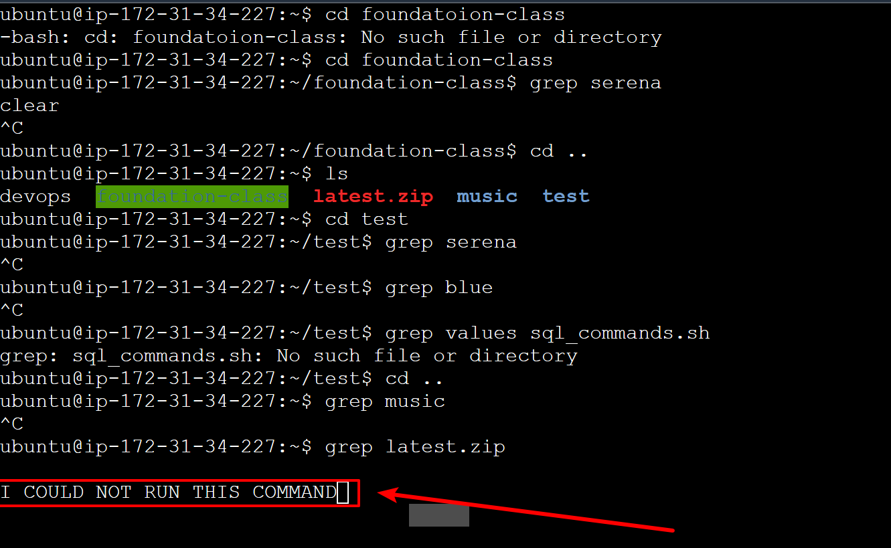

## DF COMMAND

This command is used to report the system disk space usage.

to use this command, I ran the following syntax `df -h` to see the current directory disk space
`df -m` to display information on the file system usage in MBs 
`df -k`  to diplay file system usage in KBs
`df -T`  to show file system type in a new column.

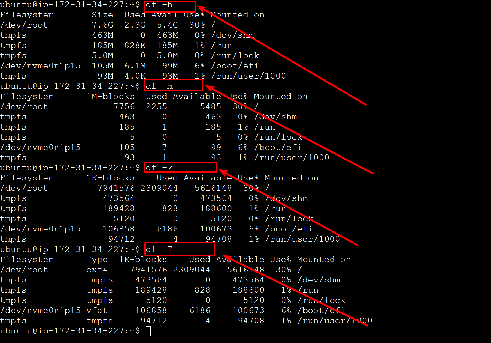

## DU COMMAND

This is used to check the exact number of space a file or directory occupies.

to run this command, i ran the following syntax `du /home/ubuntu/foundation-class`
`du -s = offers total size of a particular folder`
`du -m = provides information of a file in MB`
`du -h = provides the last modified date of a file or folder`

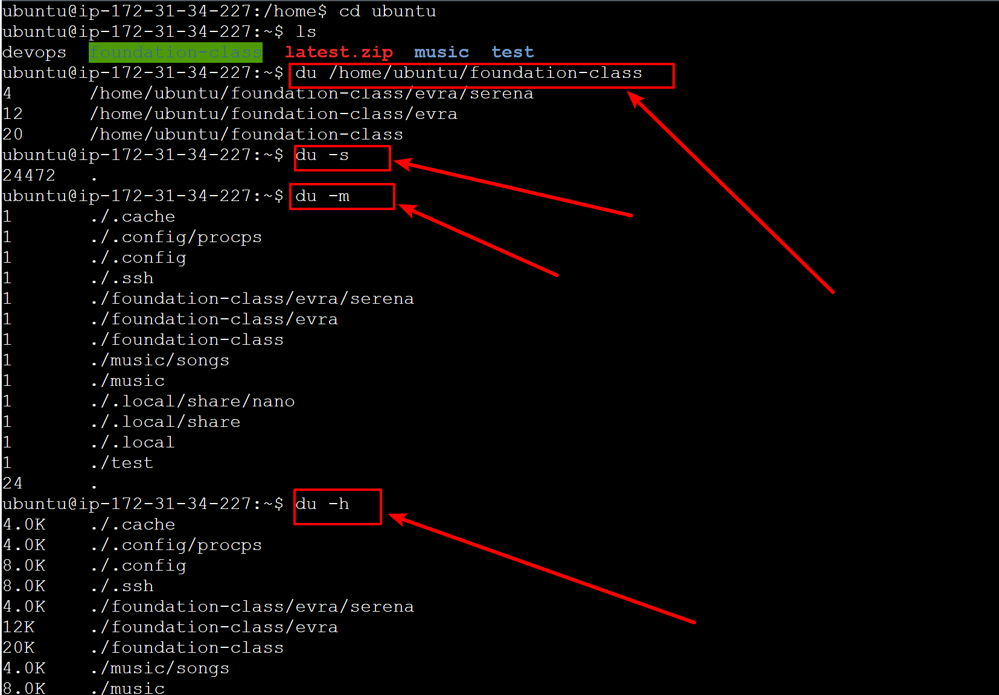

## HEAD COMMAND

This command allows you to view the first ten lines of a text in a file.

to use this command, i ran the following syntax
`head evra`

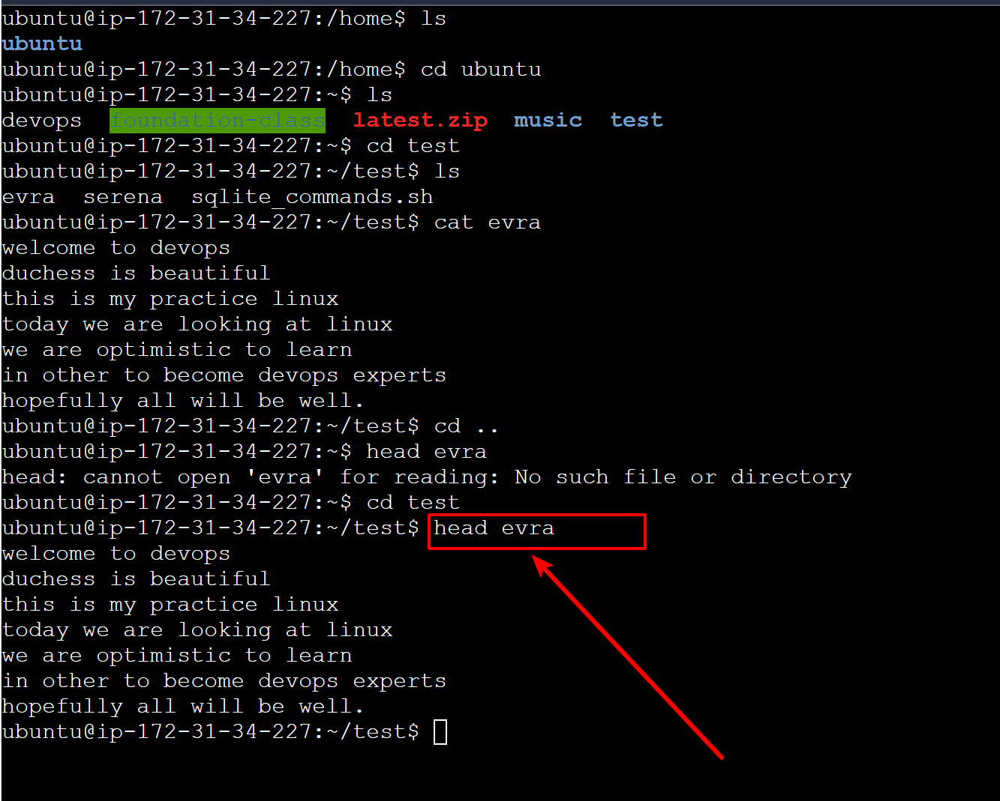

## TAIL COMMAND

This allows users to view the last ten lines of a file and it helps users to know if new text were added to a file or if an error occured.

to use this command, i ran the following syntax
`tail evra`

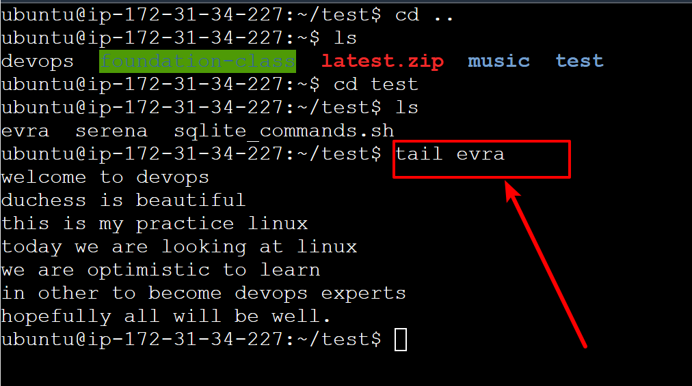

## DIFF COMMAND

This command compares two content of a file line by line and after analysing them, it will display the parts that do not match.

to use this command, I ran the following syntax `diff evra serena`

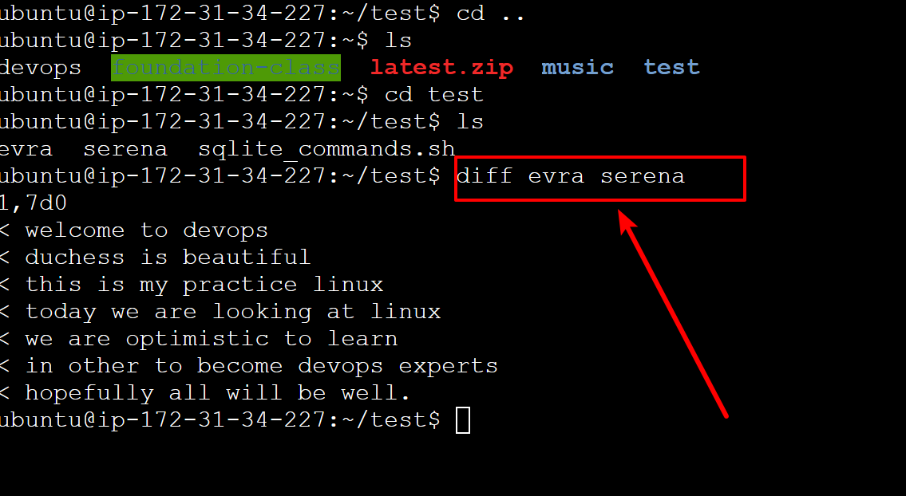

## TAR COMMAND

This command archives multiple files into a TAR file. it is similar to the ZIP file.

to use this command, I ran the following syntax
`tar -cvf newarchive.tar /home/ubuntu`

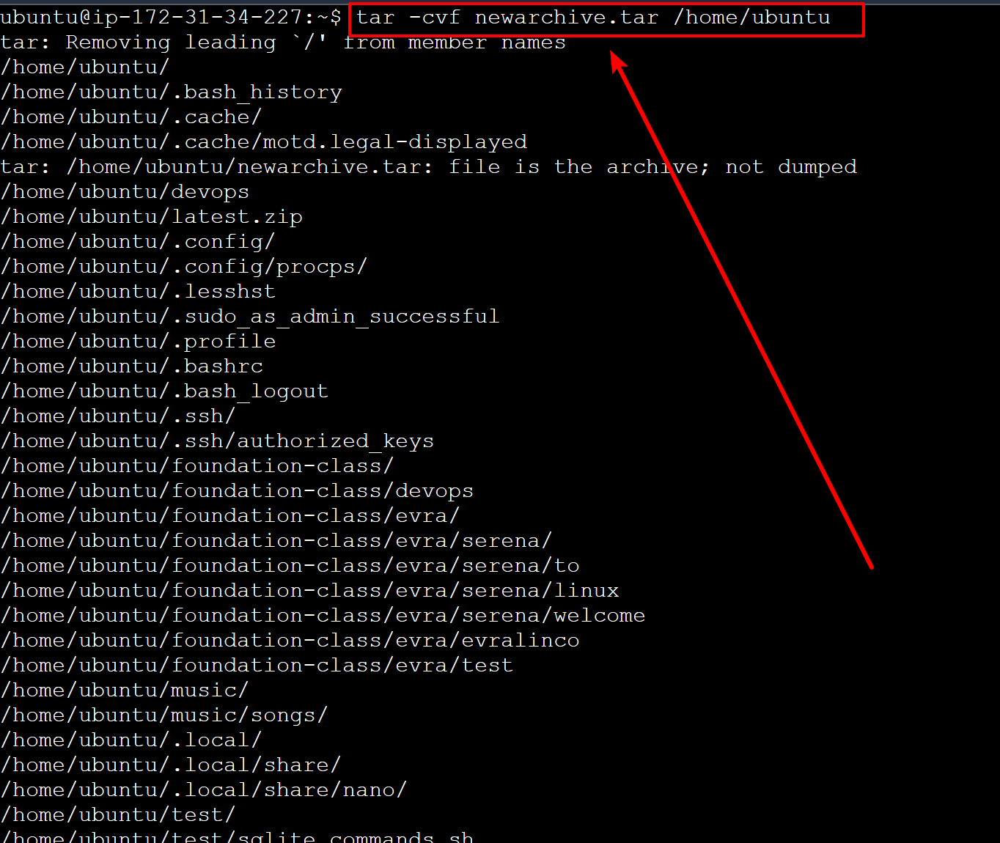

## CHMOD COMMAND

This is a command that modifies a file or directory's READ + WRITE + EXECUTE PERMISSIONS

to use this command, I ran the following syntax

`chmod 777 devops`

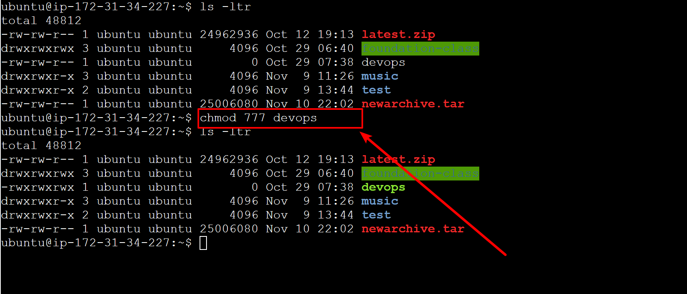

## CHOWN COMMAND

This command let you change the ownership of a file or directory.

to use this command, I ran the following syntax `chown serena`

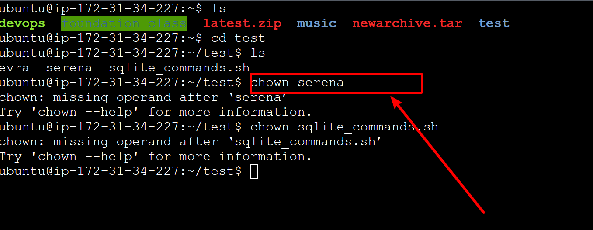

## JOBS COMMAND

This command displays all the running processes and their statuses. And it is only available in csh, bash, tcsh, ksh shells.

to use this command, I ran the following syntax
`jobs -i`

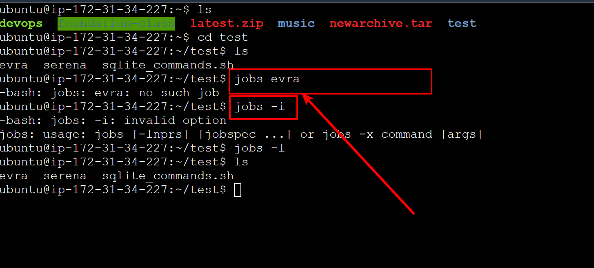

## KILL COMMAND

This command is used to terminate all unresponsive program manually and it can only be done with knowing the Process ID (PID) number.

to use this command, I ran the following syntax
`ps ux = to determine the PID number`
`Kill SIGTERM 8289 = stops program and save progress`
`Kill SIGKILL 8289 = force stop program and lose unsaved progress`

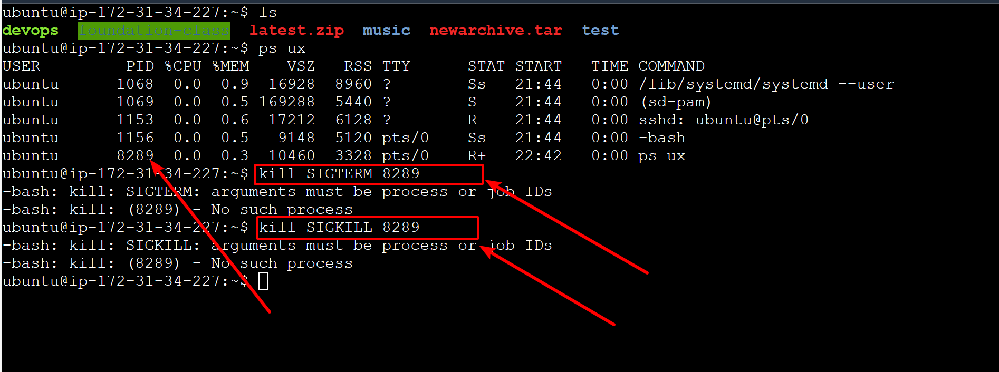

## PING COMMAND

This command is used to check whether a network or a server is reachable. Therefore, ctroubleshooting all connectivity issues.

to use this command, I ran the following syntax
`Ping princeways.com`

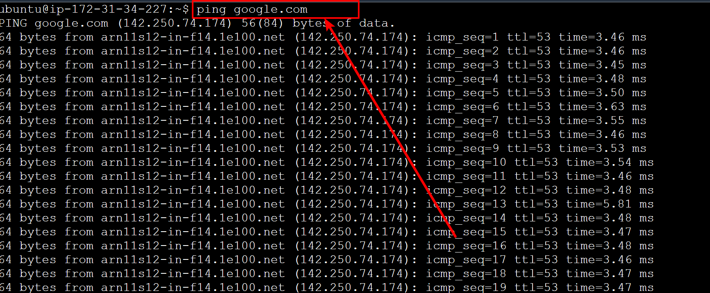

## WGET COMMAND

This is a command that lets you download files from the internet without interfering with your running processes as it is running at the background.

to use this command, I ran the following syntax
`wget https://santegidio.org/latest.zip`

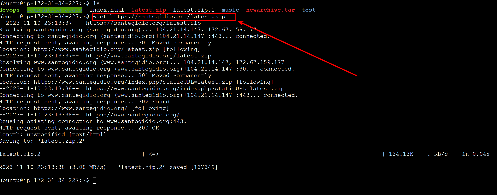

## UNAME COMMAND

This command will print in detail your linux system and hardware

to use this command, I ran the following syntax
`uname`
`uname -a = prints all the system information`
`uname -s = prints the system kernal name`
`uname -n = prints the system's node hostname`

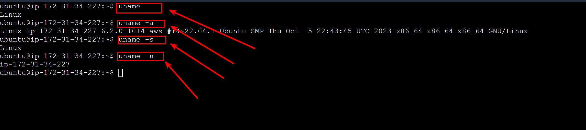

## TOP COMMAND

This command displays all the running processes and real time view of the current system from CPU to memory usage.

to use this command, I ran the following syntax
`top `

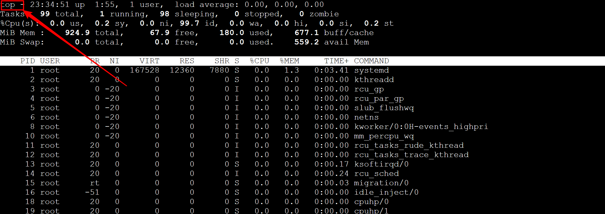

## HISTORY COMMAND

This command allow only users with sudo privileges to view list of upto 500 previously executed commands, hence, allowing user to reuse executed commands without re-entering them.

to use this command, I ran the following syntax
`History `

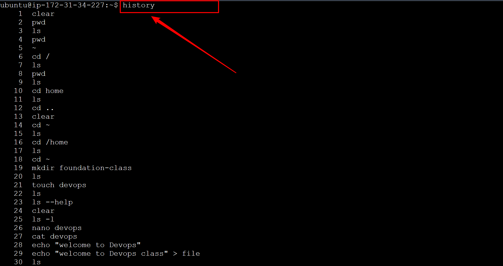

## MAN COMMAND

This command provides user manual of any command or utilities you can run on a terminal.including the name , description and options.

to use this command, I ran the following syntax
`man`

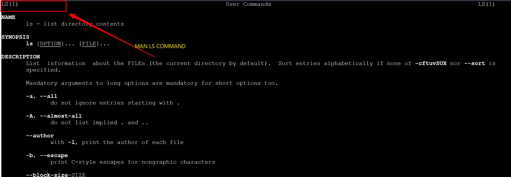

##  ECHO COMMAND

This is a built-in-utility command that displays a line of text or strings, usint the standard output.

to use this command, I ran the following syntax

`echo 'manchester-United'`

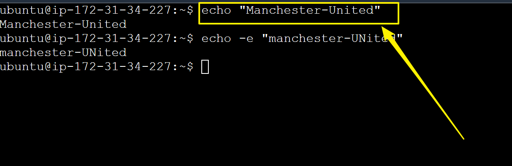

##  ZIP UNZIP COMMAND

This command is used to compress files into a ZIP file and also used to archive files and directories to reduce the disk usage size.

to use this command, I ran the following syntax

`zip latest.zip serena`
`unzip latest.zip`

## HOSTNAME COMMAND

This command enables you to know the system hostname.

to use this command, I ran the following syntax
`hostname`

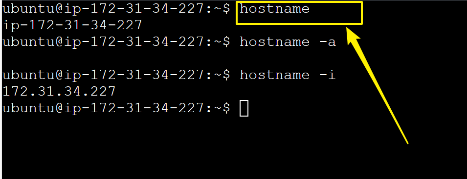

## USERADD - USERDEL COMMAND

This command allows a user with root or sudo priviledges to add a new user with password or delete a user. the useradd creates a permission and ownership to the new user in a directory.

to use this command, I ran the following syntax

`useradd -m duchess`
`userdel duchess`

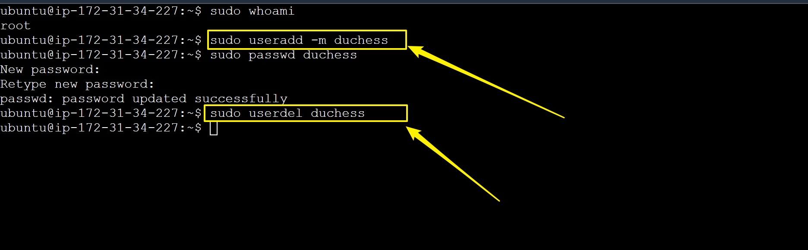

## APT-GET COMMAND

This is a command line tool used by sudo or root priviledge user for handling advance package tools APT. It helps to retrieve information from authenticated sources to manage, remove and install softwares and its dependencies.

to use this command, I ran the following syntax

`apt-get`

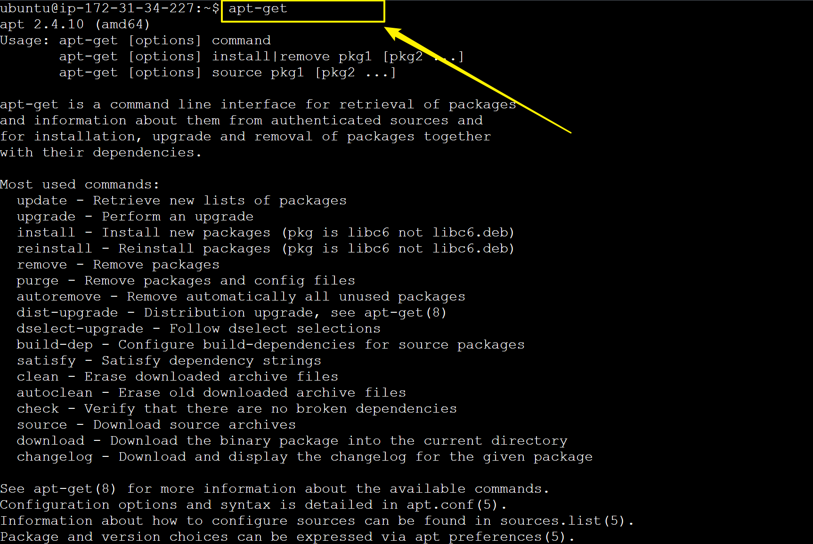

## NANO and VI COMMANDS

This are command lines that opens up a text editor used for editing and managing files.

to use this command, I ran the following syntax

`nano`
`vi`

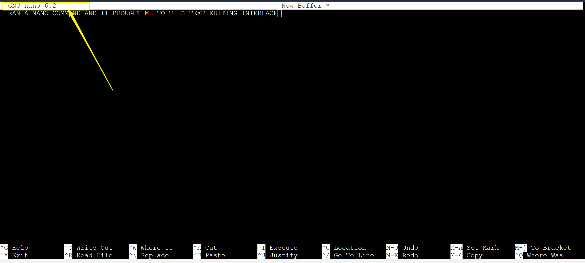

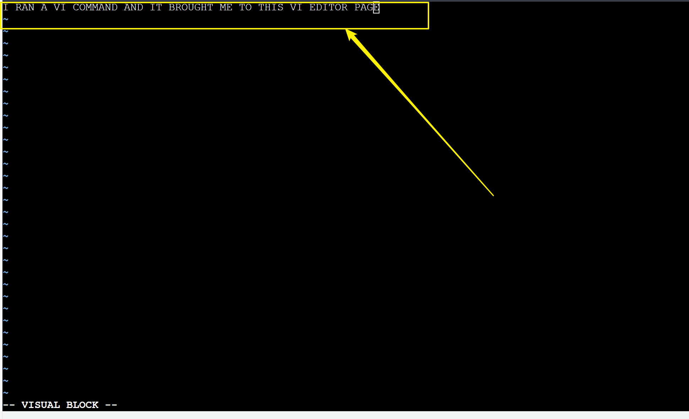

## ALIAS - UNALIAS COMMAND

This command `alias`is used to create shortcuts with the same functonality as a command, file name or text. when executed, it rinstruct the shell to replace one string with another.

while the `unalias` is used to delete the alias.

to use this command, I ran the following syntax

`alias k-'kill'`
`unalias`

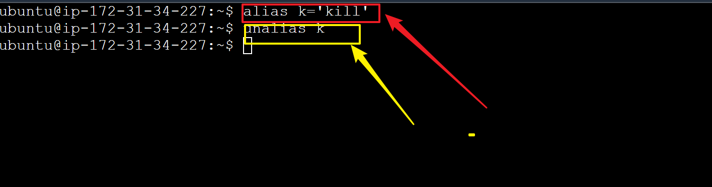

## SU COMMAND

This command is used to run a program as a different user especially when the root user priviledge is unavailable. for example, using the SSH and GUI interfaces to run the command.

to use this command, I ran the following syntax
`su`

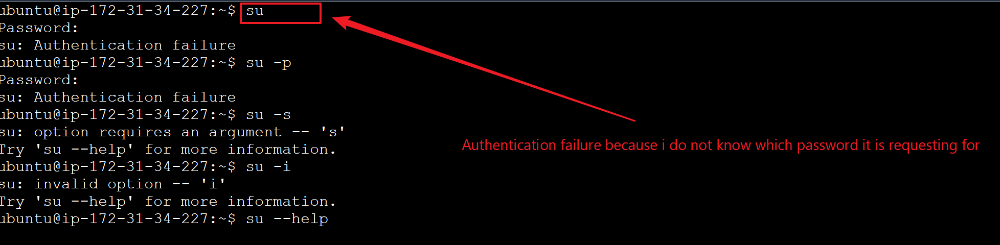
`I am not able to run this command` 

## HTOP COMMAND

This command allows for an interactive program that monitors system resources and server processes in real time.

to use this command, I ran the following syntax
`htop`   that is after it has been installed using the package manager.

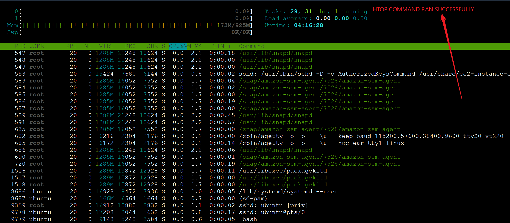

## PS COMMAND

This command produces a snapshot of all running processes in your system (Process Status)

to use this command, I ran the following syntax
`ps` this shows your Time, CMD, TTY, PID

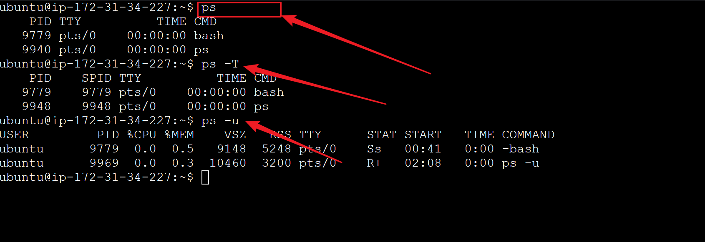

